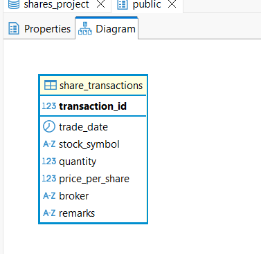
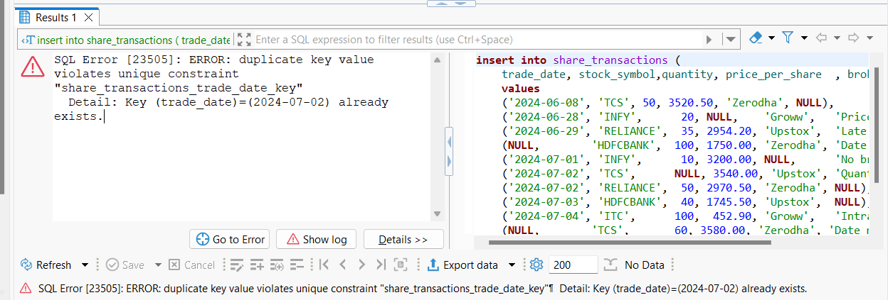

# Share Trading Analytics 

I built this SQL share trading project to practice and strengthen my foundational database skills.
Using a single transactions table, I worked through real business questions step by step: creating the schema, inserting sample data, making structural tweaks, and writing essential queries.

This project is designed for anyone learning SQL—whether you’re just starting or reviewing the basics. The queries and scripts here are simple, clear, and meant to be practical examples for self-study or quick reference.

## 📁 Project Structure

- setup_scripts/  –  Table creation, insertion, and alterations
- queries/        –  All SQL queries
- docs/           –  Screenshots and outputs
- README.md       –  Project summary

## 🗂 Table Schema

This project uses a single table called `share_transactions` with the following columns:

| Column Name       | Data Type      | Description                        |
|-------------------|---------------|------------------------------------|
| transaction_id    | SERIAL (PK)   | Unique identifier for each trade   |
| trade_date        | DATE          | Date of transaction                |
| stock_symbol      | VARCHAR(10)   | Stock/company symbol               |
| quantity          | INTEGER       | Number of shares traded            |
| price_per_share   | NUMERIC(10,2) | Price per share at transaction     |
| broker            | VARCHAR(100)  | Broker name                        |
| remarks           | VARCHAR(200)  | Extra details or notes             |

Below is the schema diagram for this table:

## 📘 What I Tried Out

- Built the table and set up all columns from scratch
- Added realistic (but simple) sample share trading data
- Practiced changing the table structure—like adding or removing columns
- Wrote easy-to-follow SELECT queries to answer common trading questions
- Included screenshots so you can see exactly what results I got

## 📜 SQL Queries

1. Query_1.sql – Show all transactions
2. Query_2.sql – Count total number of transactions
3. Query_3.sql – List all unique stock symbols
4. Query_4.sql – All trades where broker is Zerodha
5. Query_5.sql – List all transactions, highest to lowest price per share
6. Query_6.sql – Calculate total price for each transaction
7. Query_7.sql – Total shares purchased for each stock symbol
8. Query_8.sql – Highest price per share in all transactions
9. Query_9.sql – Mark each transaction as 'High Value' if price_per_share > 2000, else 'Normal'
10. Query_10.sql – Show all transactions with NULL values replaced by defaults

## 🛠️ How to Use

1. Run scripts from `setup_scripts/` to create and prepare the table.
2. Use the queries in `queries/` to analyze the data.
3. Check the `docs/` folder for screenshots and reference outputs.

## 🐞 Mistakes I Made (And What I Learned)

During this project, I ran into a few classic beginner problems—and some surprises too! Here’s what tripped me up and how I figured things out:

---

### Decimal Shares (Quantity Column)

**What happened:**  
At first, I set the quantity column as `NUMERIC(10,2)`. It sounded logical, but then I realized—wait, you can’t actually buy half a share in real life!

**How I fixed it:**  
Changed the column type to `INTEGER` using `ALTER TABLE`. Easy fix, and made way more sense.

---

### Remarks Column Was Too Short

**What happened:**  
I kept running into trouble when trying to write longer notes—`VARCHAR(50)` just wasn’t enough!

**How I fixed it:**  
Increased it to `VARCHAR(200)`. Now I have plenty of space for remarks.

---

### Unique Constraint on Trade Date

**What happened:**  
Total rookie mistake: I accidentally made the `trade_date` column unique. Of course, you can have more than one trade on the same day. Got an error when inserting data.

**How I fixed it:**  
Dropped the unique constraint—now multiple trades on the same date work fine.

*Screenshot of the error:*

---

### Transaction IDs Didn’t Start at 1

**What happened:**  
After deleting and re-adding rows, my `transaction_id` column (auto-increment) started from 8 instead of 1.

**How I fixed it:**  
Used `TRUNCATE TABLE ... RESTART IDENTITY` to reset everything so IDs start from 1 again.

---

Messing up and then figuring out the fixes actually helped me understand how databases work in the real world. Every mistake made things a bit clearer—and honestly, that’s the best way to learn!

